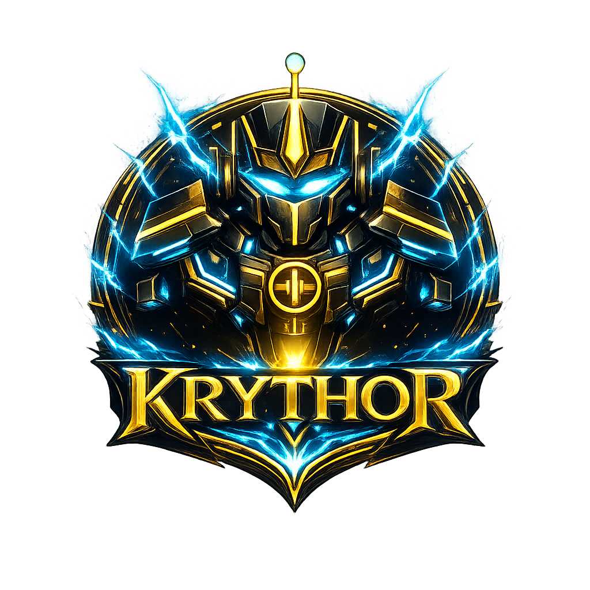

<p align="center">
  
</p>

<h1 align="center">Krythor</h1>

<p align="center">Your AI. Your machine. Your rules.</p>

---

Most AI tools are black boxes. You send a message, something happens somewhere, and you get an answer back. You have no idea which model ran it, why it chose that response, what it remembered, or what it's allowed to do.

**Krythor is the opposite.**

Every agent run is visible. Every model choice is explained. Every action is guarded by rules you define. Memory persists across sessions and improves over time. You can connect any model — local or cloud — route between them automatically, and watch it all happen in real time inside a live Command Center running entirely on your machine.

No subscriptions to what you can run. No hidden cloud layer processing your data. No vendor telling you which model to use. Just a powerful, self-hosted AI platform you fully control.

**Current version: v0.9.0**

---

## What is Krythor?

Krythor is a local-first AI command platform. Run agents, route across models, enforce guardrails, and persist memory — all from a single interface on your own machine.

---

## Features

**Agents & Reasoning**
- Custom agents with configurable system prompts, model preferences, memory scope, tool permissions, and safety profiles
- Structured reasoning loop — every agent run is decomposed into a plan before execution; each step is tracked with timing and token counts; output is verified against the original task for complex runs
- Agent chaining and handoffs — agents can spawn sub-agents and delegate tasks
- Agent health monitoring — automatic pausing when stability drops; auto-recovery after a configurable window
- Per-agent token budgets — daily and per-session caps with clean error responses when exceeded
- Extended thinking — automatically enabled for complex runs on Anthropic providers

**Memory**
- Persistent semantic memory with TF-IDF retrieval across sessions; auto-upgrades to neural embeddings if Ollama is running locally
- Importance scoring, recency decay, and automatic pruning
- Named knowledge base, session memory, and agent-scoped memory
- Memory janitor runs every 6 hours; configurable from the UI

**Model Routing**
- Connect any combination of OpenAI, Anthropic, Ollama, LM Studio, OpenRouter, Groq, Mistral, Google Gemini, AWS Bedrock, Venice, and any OpenAI-compatible API
- Automatic fallback with circuit breaker and per-provider retry config
- Named fallback chains — define ordered provider sequences scoped to a task type, agent, or skill
- Provider priority ordering — configure which providers are tried first
- Privacy routing — sensitive content automatically re-routed to local models

**Operating Profiles**
- Named operating modes that control which providers, skills, and tools are available
- Three privacy modes: Local Only, Standard, and Unrestricted
- Per-profile token caps and operation restrictions
- Activate globally or per-agent; manage from the Profiles tab

**Skills & Vault**
- Reusable task templates with input/output schemas and structured routing hints
- Skill chaining — chain skills sequentially, passing each step's output to the next
- Skill evolution proposals — structured change proposals with approve/reject/apply workflow and full version history
- Vault with 40 official skills across 6 collections: Real Estate, Finance, Productivity, Communication, Business Workflow, and Starter Pack
- Local JSON import for community skills with live risk analysis before install

**Talent Marketplace**
- Private directory for vendors, contractors, referral agents, and service providers
- AI-powered ranking across 7 dimensions: category fit, geography, trust score, response history, recency, urgency boost, and preferred status — every result is fully explained
- Trust scores computed from response rate, job outcomes, recency, and preferred flag; automatically recalculated daily
- Outreach queue with approval-gated sending; full interaction and outcome logging
- 6-view UI: Dashboard, Directory, Talent Detail, Request Matcher, Outreach Queue, Create/Edit form
- Native `talent_marketplace` skill for agent-driven workflows

**SafeCore**
- Containment and execution control layer — run agents in sandboxed execution tiers before anything touches the host
- Four execution modes: Read Only, Workspace, Connector Controlled, Elevated Access
- Approval workflow — executions requiring elevated access pause for operator review before proceeding; trust level (Safe / Needs Approval / High Risk) is inferred automatically from the action type and shown prominently in every approval modal
- Promotion workflow — completed runs stay contained until an operator approves promotion to host
- Per-mode policy configuration: allowed paths, blocked commands, allowed hosts, retention rules
- Full audit trail: every action, file touched, command run, network attempt, approval, and promotion logged with trust-level indicators
- 5-view UI: SafeCore Dashboard, Runs, Review Queue, Promotion Review, Activity

**Guardrails & Safety**
- Policy engine with allow / deny / warn / require-approval per operation
- Three safety modes: Guarded (deny-by-default), Balanced (warn), Power User (unrestricted)
- Approval flow — pauses execution and surfaces a modal; streaming-compatible
- Audit log — append-only NDJSON + SQLite; queryable via CLI and Audit tab
- External content isolation — web search and fetch results wrapped in safe markers to prevent prompt injection

**Communication**
- Chat channels: Telegram, Discord, WhatsApp, Slack, Signal, Mattermost, Google Chat, BlueBubbles, iMessage, Web Chat (browser-based, session-persistent)
- Outbound webhooks with HMAC-SHA256 signing; compatible with Zapier, n8n, Discord/Slack
- Peer networking — gateway-to-gateway over LAN (UDP multicast) or Tailscale

**UI & Control**
- Command Center — live animated scene with a Cybernetic Brain Planet and five agent entities that react to real-time activity
- 31 tabs covering every subsystem; customizable tab bar with pinning
- Ctrl+K command palette — fuzzy-search navigation across all tabs
- Slash commands — `/new`, `/clear`, `/model`, `/agent`, `/think`, `/fast`, `/verbose`, and more
- Token Cost Feed — live view of every inference with model, tokens, and estimated cost
- Real-time event stream, live log viewer, config editor, and file browser

**Infrastructure**
- Cron job scheduler with cron expressions, fixed intervals, and one-shot timestamps
- Standing orders — persistent directives injected into every matching agent run
- Named API keys with scoped permissions
- Full config export/import — agents, guard policies, cron jobs, channels, skills (keys redacted)
- Daemon mode, auto-update checks, backup command, and Doctor + Repair diagnostics
- Docker support with health endpoints

---

## Install

### One-line install (recommended)

No Node.js required — the installer includes a bundled runtime.

**Mac / Linux:**
```bash
curl -fsSL https://raw.githubusercontent.com/LuxaGrid/Krythor/main/install.sh | bash
```

**Windows (PowerShell):**
```powershell
iwr https://raw.githubusercontent.com/LuxaGrid/Krythor/main/install.ps1 | iex
```

Then start Krythor and open `http://localhost:47200`.

### From source

```bash
git clone https://github.com/LuxaGrid/Krythor
cd Krythor
pnpm install && pnpm run build
node start.js
```

Requires Node.js 22+ and pnpm (`npm install -g pnpm`).

### Docker

```bash
docker compose up -d
```

### Updates

```bash
krythor update
```

Settings, memory, and data are always preserved.

---

## Getting started

1. Install using the one-line installer above
2. Run `krythor` (or `Krythor.bat` on Windows)
3. Open `http://localhost:47200`
4. Go to **Models** → add at least one provider (Ollama for free local use, or paste an API key for cloud)
5. Open **Chat** and send your first message

---

## Supported providers

| Provider | Type | API key |
|---|---|---|
| Ollama | Local | No |
| LM Studio | Local | No |
| OpenAI | Cloud | Yes |
| Anthropic | Cloud | Yes |
| Google Gemini | Cloud | Yes |
| Mistral | Cloud | Yes |
| Groq | Cloud | Yes |
| OpenRouter | Cloud | Yes |
| Venice | Cloud | Yes |
| AWS Bedrock | Cloud | Yes |
| Any OpenAI-compatible | Local/Cloud | Optional |

---

## Keyboard shortcuts

| Shortcut | Action |
|---|---|
| Ctrl+K | Open command palette |
| Enter | Send message |
| Shift+Enter | New line in message input |
| `/` | Begin a slash command |
| Escape | Dismiss palette or dropdown |
| Ctrl+S | Save in Config Editor |

---

## Slash commands

| Command | Action |
|---|---|
| `/new` | Start a new conversation |
| `/clear` | Clear the current conversation |
| `/compact` | Summarize and compact old turns |
| `/model [id]` | Switch the active model |
| `/agent [id]` | Switch the active agent |
| `/think [level]` | Set extended thinking: off · minimal · low · medium · high · xhigh · adaptive |
| `/fast [on\|off]` | Toggle fast routing preference |
| `/verbose [on\|full\|off]` | Control tool-call verbosity |
| `/subagents` | List or manage spawned sub-agents |
| `/devices` | List connected peer devices |

---

## Troubleshooting

**"krythor: command not found"**
Open a new terminal window. The PATH update requires a fresh session. On Mac/Linux you can also run `source ~/.bashrc` (or `~/.zshrc`).

**Dashboard won't load at http://localhost:47200**
Make sure Krythor is running — you should see activity in the terminal. If it crashed, re-run `krythor`.

**"No AI provider configured"**
Add at least one provider in the **Models** tab before sending commands.

**Windows SmartScreen warning on the .exe installer**
Expected — the installer is unsigned. Click "More info" → "Run anyway". The PowerShell one-liner is a more transparent alternative.

**"Gateway did not start"**
Run the built-in repair check:
```bash
krythor repair
```

**Command Center shows "DEMO MODE"**
Normal when no real agent runs are active. Switches to live data automatically once the gateway processes events.

**Moving to a new machine**
```bash
krythor backup        # on the old machine
krythor repair --fix  # on the new machine after install and restore
```

---

## Project structure

```
packages/
  gateway/   — API server, agent runner, model routing, guardrails
  control/   — React control UI
  core/      — Agent orchestration, reasoning engine, tools
  memory/    — SQLite persistence, semantic search, knowledge base
  models/    — Provider adapters, model router, inference
  guard/     — Policy engine, approval flows, audit logging
  skills/    — Skill registry, runner, composer, vault
  setup/     — Installer and first-run wizard
vault/       — Official skill catalog (40 skills)
docs/        — Full documentation
```

---

## Development

```bash
pnpm install        # install dependencies
pnpm run build      # build all packages
pnpm run dev        # start gateway in dev mode
pnpm run test       # run all tests
pnpm run typecheck  # type-check all packages
pnpm run lint       # lint all packages
```

CI runs lint, typecheck, and the full test suite automatically on every push and PR to `main`.

---

## Documentation

Full docs are in the [`docs/`](./docs/) directory.

---

## License

See [LICENSE](./LICENSE).
